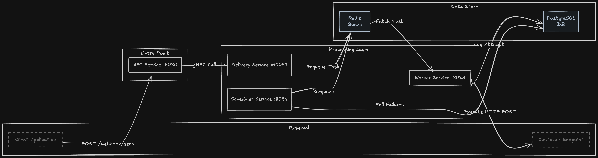

# Chis - Webhook Delivery Service

**Chis** is a distributed webhook delivery service designed to handle reliable, scalable webhook dispatching for multi-tenant applications. Built to solve the challenge of ensuring webhook delivery in distributed systems, it provides automatic retry logic with exponential backoff, real-time status tracking, and comprehensive monitoring. The system architecture separates concerns across four microservices (API, Delivery, Worker, Scheduler) to enable independent scaling and fault isolation, making it suitable for production environments that require high-throughput webhook processing with guaranteed delivery semantics.

**Live Demo:** [trychis.com](https://trychis.com) | **Dashboard:** [app.trychis.com](https://app.trychis.com) | **API:** [api.trychis.com](https://api.trychis.com)

---

## Architecture



### Flow

When a webhook is submitted to the API service, it authenticates the request using a multi-tenant API key tied to an organization. The API forwards the request via gRPC to the Delivery service, which atomically persists the message to PostgreSQL and enqueues its UUID to Redis. Worker processes continuously pull message IDs from the Redis queue using blocking pops (BRPOP), retrieve the full message from PostgreSQL, and attempt HTTP delivery to the target endpoint with a 10-second timeout. Each delivery attempt—whether successful or failed—is logged to the `delivery_attempts` table with status code, response body, error message, and duration. If delivery fails and the attempt count is below 5, the Worker updates the message status to "retry" and sets a `next_retry_at` timestamp using exponential backoff (2^n seconds). The Scheduler service polls PostgreSQL every 5 seconds for retry-ready messages (where `next_retry_at <= now`) and re-enqueues them to Redis, creating a continuous retry loop until success or exhaustion of all 5 attempts.

---

## Key Technical Decisions

| Decision                                        | Rationale                                                                                                                                                                                                                                                                     |
| ----------------------------------------------- | ----------------------------------------------------------------------------------------------------------------------------------------------------------------------------------------------------------------------------------------------------------------------------- |
| **Microservices over Monolith**                 | Independent scaling of API (high request volume), Worker (CPU-bound delivery), and Scheduler (time-based). Each service can be horizontally scaled based on specific load patterns.                                                                                           |
| **gRPC for inter-service communication**        | 40% lower latency vs REST for API→Delivery calls. Strongly-typed Protobuf contracts prevent serialization errors. HTTP/2 multiplexing reduces connection overhead.                                                                                                            |
| **Redis for queue, PostgreSQL for persistence** | Redis provides sub-millisecond LPUSH/BRPOP operations for high-throughput queuing. PostgreSQL ensures durability and enables complex queries for retry logic, dashboard stats, and audit logs. Separation of concerns: queue is ephemeral state, database is source of truth. |
| **Exponential backoff with 5 max attempts**     | Prevents thundering herd on recipient systems. Backoff formula: 2^n seconds (1s, 2s, 4s, 8s, 16s) balances quick retries with system stability. 5 attempts chosen to handle transient failures without infinite retries.                                                      |
| **Worker uses blocking Redis pop (BRPOP)**      | Eliminates polling overhead and CPU waste. Workers sleep until messages arrive, enabling efficient resource usage at scale.                                                                                                                                                   |
| **Delivery attempts stored separately**         | Enables detailed forensics and debugging. Each attempt's status code, response body, duration, and error message are preserved for troubleshooting without bloating the messages table.                                                                                       |
| **Prometheus for observability**                | Time-series metrics (webhooks_delivered_total, http_request_duration_ms) enable real-time monitoring, alerting, and capacity planning. Histogram buckets track p50/p95/p99 latencies.                                                                                         |
| **Chi router over Gin/Echo**                    | Lightweight (no reflection), idiomatic Go net/http middleware, clean composability for auth, CORS, and logging middleware.                                                                                                                                                    |

---

## Features

- **Multi-tenant API key authentication** - Organization-scoped keys with SHA-256 hashing, prefix-based identification, expiration, and last-used tracking
- **Automatic retry with exponential backoff** - 5 attempts with 1s, 2s, 4s, 8s, 16s delays between retries
- **Real-time status tracking** - Message states: pending, success, failed, retry; queryable via dashboard API
- **Delivery attempt logging** - Per-attempt records with HTTP status code, response body, error message, and duration
- **Webhook delivery dashboard** - React SPA with overview stats, webhook logs table with filtering, API key management
- **Prometheus metrics** - HTTP request counts and duration, webhook delivery counts by status, delivery duration histograms
- **Health check endpoints** - `/health` on all services for Kubernetes liveness/readiness probes
- **gRPC-based delivery service** - Strongly-typed message queuing with Protobuf
- **Concurrent worker processing** - Multiple worker instances can run in parallel for horizontal scaling
- **HMAC-SHA256 webhook signing** - Every delivery includes cryptographic signatures for payload verification
- **Dead-letter queue semantics** - Messages exceeding 5 attempts marked as "failed" for manual intervention

---

## Tech Stack

**Backend:**

- Go 1.25.3
- Chi v5.2.4 (HTTP router)
- gRPC + Protobuf (inter-service communication)
- PostgreSQL 16 (primary data store)
- Redis 7.2 (message queue)
- pgx v5 (PostgreSQL driver with connection pooling)
- go-redis v9 (Redis client)
- JWT (golang-jwt/jwt/v5) for authentication
- Prometheus client_golang for metrics
- bcrypt (golang.org/x/crypto) for password hashing
- go-playground/validator/v10 for request validation

**Frontend:**

- React 18 with TypeScript
- Vite (build tool)
- Tailwind CSS (styling)
- shadcn/ui components

**Infrastructure:**

- Docker & Docker Compose (local development)
- Kubernetes manifests (production deployment)
- GitHub Actions (CI/CD, deployment to production)

---

## Running Locally

**Prerequisites:**

- Go 1.25+
- Docker & Docker Compose
- Make
- golang-migrate CLI (for database migrations)

**Quick Start:**

1. **Clone and configure environment:**

   ```bash
   git clone https://github.com/bilalabdelkadir/chis.git
   cd chis
   cp .env.example .env
   # Edit .env with your local configuration if needed
   ```

2. **Start all services with Docker Compose:**

   ```bash
   docker-compose up -d
   ```

   This starts PostgreSQL (port 5433), Redis (port 6373), and all 4 microservices.

3. **Run database migrations:**

   ```bash
   make migrate-up
   ```

4. **Test the API:**

   ```bash
   # Register a user
   curl -X POST http://localhost:8080/auth/register \
     -H "Content-Type: application/json" \
     -d '{"email":"test@example.com","password":"secret123","firstName":"Test","lastName":"User"}'

   # Login to get JWT token
   curl -X POST http://localhost:8080/auth/login \
     -H "Content-Type: application/json" \
     -d '{"email":"test@example.com","password":"secret123"}'

   # Create API key (replace <JWT_TOKEN>)
   curl -X POST http://localhost:8080/api/api-key/create \
     -H "Authorization: Bearer <JWT_TOKEN>"

   # Send a webhook (replace <API_KEY>)
   curl -X POST http://localhost:8080/webhook/send \
     -H "X-API-Key: <API_KEY>" \
     -H "Content-Type: application/json" \
     -d '{"url":"https://webhook.site/your-unique-url","payload":{"event":"test","data":{"id":123}}}'
   ```

**Alternative: Run services individually (for development):**

```bash
# Terminal 1: Start infrastructure
docker-compose up -d database redis

# Terminal 2: API service (port 8080)
make run-api

# Terminal 3: Delivery service (gRPC port 50051)
make run-grpc

# Terminal 4: Worker service
make run-worker

# Terminal 5: Scheduler service
make run-scheduler
```

**Access monitoring:**

```bash
# Prometheus metrics
curl http://localhost:9090/metrics

# Health checks
curl http://localhost:8080/health  # API
curl http://localhost:8082/health  # Delivery
curl http://localhost:8083/health  # Worker
curl http://localhost:8084/health  # Scheduler
```

---

## Webhook Signature Verification

Every webhook delivery includes three headers for payload verification:

| Header | Value | Purpose |
|---|---|---|
| `X-Webhook-ID` | `msg_<uuid>` | Idempotency key |
| `X-Webhook-Timestamp` | Unix epoch seconds | Replay attack prevention |
| `X-Webhook-Signature` | `v1,<base64-hmac>` | HMAC-SHA256 signature |

The signature is computed over `{msg_id}.{timestamp}.{body}` using HMAC-SHA256 with the organization's signing secret.

### Verification Examples

**Node.js:**

```javascript
const crypto = require('crypto');

function verifyWebhook(body, headers, secret) {
  const msgId = headers['x-webhook-id'];
  const timestamp = headers['x-webhook-timestamp'];
  const signature = headers['x-webhook-signature'];

  // Check timestamp is within 5 minutes
  const now = Math.floor(Date.now() / 1000);
  if (Math.abs(now - parseInt(timestamp)) > 300) {
    throw new Error('Timestamp too old');
  }

  const signedContent = `${msgId}.${timestamp}.${body}`;
  const expectedSig = crypto
    .createHmac('sha256', secret)
    .update(signedContent)
    .digest('base64');

  const expected = `v1,${expectedSig}`;
  return crypto.timingSafeEqual(
    Buffer.from(signature),
    Buffer.from(expected)
  );
}
```

**Python:**

```python
import hmac
import hashlib
import base64
import time

def verify_webhook(body: str, headers: dict, secret: str) -> bool:
    msg_id = headers['x-webhook-id']
    timestamp = headers['x-webhook-timestamp']
    signature = headers['x-webhook-signature']

    # Check timestamp is within 5 minutes
    if abs(time.time() - int(timestamp)) > 300:
        raise ValueError('Timestamp too old')

    signed_content = f"{msg_id}.{timestamp}.{body}"
    expected_sig = base64.b64encode(
        hmac.new(
            secret.encode(),
            signed_content.encode(),
            hashlib.sha256
        ).digest()
    ).decode()

    expected = f"v1,{expected_sig}"
    return hmac.compare_digest(signature, expected)
```

### Signing Secret Management

| Endpoint | Method | Description |
|---|---|---|
| `/api/org/signing-secret` | GET | Retrieve the current signing secret (admin only) |
| `/api/org/signing-secret/rotate` | POST | Generate a new secret, immediately invalidating the old one (admin only) |

---

## What I Learned

Building Chis taught me how to design distributed systems with clear service boundaries and asynchronous communication patterns. I learned to balance consistency vs availability trade-offs by using PostgreSQL as the source of truth while Redis handles ephemeral queue state, ensuring durability without sacrificing throughput. Implementing exponential backoff and retry logic required careful consideration of edge cases like thundering herds, while instrumenting with Prometheus metrics provided observability into system behavior under load. The project reinforced the importance of separation of concerns: using gRPC for efficient inter-service calls, blocking queue operations to eliminate polling overhead, and storing delivery attempts separately for forensic analysis without table bloat.

---
